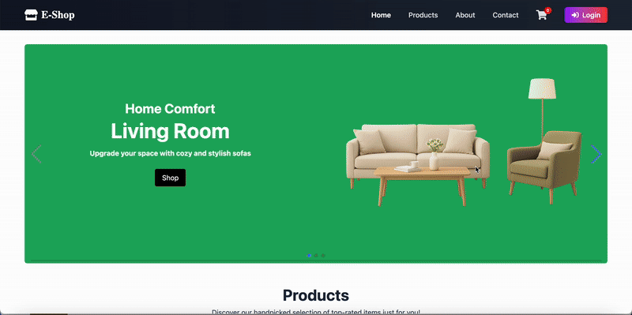

# E‑Shop Frontend (React + Vite + Redux)

## 🎬 Demo

**Overview**
- A production-ready e-commerce frontend built with React + Vite, covering both user-facing and admin features.
- Includes home, product listing with filters, product detail, cart, checkout with Stripe integration, and a payment success page.
- Admin area includes dashboard, product management (create/update/delete, image upload, detail preview), category management, seller management, order management, and inventory management.
- Uses Redux for global state, Axios for HTTP, cookie-based sessions with robust 401 refresh, and Tailwind CSS + MUI for UI.

**Tech Stack**
- React 18, Vite
- Routing: `react-router-dom`
- State: `@reduxjs/toolkit`, `react-redux`
- HTTP: `axios`
- UI: Tailwind CSS, MUI (`@mui/material`, `@mui/x-data-grid`)
- Payments: Stripe (`@stripe/react-stripe-js`, `@stripe/stripe-js`)
- Notifications: `react-hot-toast`
- Icons: `react-icons`

**Prerequisites**
- Node.js 18+ and npm (or pnpm/yarn).
- A running backend (see link below) with CORS configured for credentials.
- A Stripe publishable key (test or live).

**Quick Start**
- Clone and install:
  - `git clone <this-repo-url>`
  - `cd ecom-frontend`
  - `npm install`
- Configure environment in a `.env` file at the project root:
  - `VITE_BACK_END_URL=http://localhost:8080`
  - `VITE_STRIPE_PUBLISHABLE_KEY=pk_test_...` (use a Stripe test key)
- Start the backend (required for a working app):
  - Follow the backend README: https://github.com/oneyx88/ecommerce-backend
  - Ensure it runs and accepts credentials from this frontend origin
- Run the frontend:
  - `npm run dev`
  - Open `http://localhost:5173`
- Optional: Production build and preview
  - `npm run build`
  - `npm run preview`

**Environment Variables**
- `VITE_BACK_END_URL`: Backend base URL used by Axios and image URL resolution.
- `VITE_STRIPE_PUBLISHABLE_KEY`: Stripe publishable key for `loadStripe`.
- Example `.env`:
  - `VITE_BACK_END_URL=http://localhost:8080`
  - `VITE_STRIPE_PUBLISHABLE_KEY=pk_test_xxx_your_key_here`

**Project Structure**
- `src/api/api.js`: Axios client and interceptors.
- `src/components`: Pages and shared UI (Navbar, Sidebar, Modal, DeleteModal, ProductCard, Filter, Paginations, etc.).
- `src/hooks`: `useProductFilter`, `useCategoryFilter`, `useDashboardProductFilter`.
- `src/store`: Redux actions, reducers, and store config.
- `src/utils`: Formatting helpers, constants, banner configs, text utilities.

**Routing & Auth**
- Defined in `src/App.jsx`, guarded by `components/PrivateRoute.jsx`.
- Public: `/`, `/products`, `/products/:id`, `/about`, `/contact`, `/payment-success`.
- Private (login required): `/cart`, `/profile`, `/checkout`.
- Admin/Seller: `/admin` and children (`dashboard`, `products`, `sellers`, `categories`, `orders`, `inventory`).
- Login/Register: public but redirect to home if already logged in.
- Role detection supports `user.role` and `user.roles` values `ADMIN/ROLE_ADMIN` and `SELLER/ROLE_SELLER`.

**State Management**
- `store/reducers/store.js` registers reducers:
  - `products`: list, categories, pagination, detail
  - `auth`: session, user, tokens, init state, Stripe `clientSecret`
  - `cart`: items, total price, loading/error
  - `addresses`: list, selected ID/detail, loading/saving
  - `paymentMethod`: selected payment method
  - `seller`: seller list and pagination
  - `errors`: global loading/error, plus category/detail-specific statuses
- `store/actions/index.js`:
  - Products: `fetchProducts`, `fetchSellerProducts`, `fetchProductById`
  - Categories (admin): CRUD actions and list fetching
  - Sellers (admin): list and create
  - Products (admin): update, delete, create, image upload
  - Auth: `bootstrapSession`, login/register/logout, refresh scheduling
  - Cart: add/update/remove/fetch/clear
  - Checkout: order creation, Stripe init, local cleanup
- Responses are normalized across multiple possible backend shapes (`productSummaries`, `items`, `content`, raw arrays).

**API Client & Interceptors**
- `axios.create({ baseURL: import.meta.env.VITE_BACK_END_URL, withCredentials: true })` with cookie-based sessions.
- 401 handling (except login/refresh/logout):
  - Calls `/users/refresh` and retries original request after success.
  - On refresh failure: attempts `/users/logout`, dispatches `AUTH_LOGOUT`, navigates to `/login`.
- Image URLs: If relative, resolved as `${VITE_BACK_END_URL}/images/<name>`.

**User Features**
- Home: `HeroBanner`, top products grid.
- Products: filter by category/sort/search; server-backed pagination; loading/error states.
- Product Detail: price/special price/discount/stock/description; quantity control; add to cart.
- Cart: item list with quantity adjustments and removal, total calculation, checkout link.
- Checkout: address selection, order confirmation, payment method, Stripe payment.
- Payment Success: confirmation message.

**Admin Features**
- Layout: sidebar + `Outlet` rendering.
- Products: `DataGrid` with server pagination, CRUD, image upload, view detail.
- Categories: list and CRUD.
- Sellers: list and create; filtering.
- Orders: role-based data, cancel order.
- Inventory: adjust and view stocks.

**Custom Hooks**
- `useProductFilter`: reads `page/sort/category/q` and dispatches product fetching.
- `useDashboardProductFilter`: picks seller vs admin product endpoint based on role.
- `useCategoryFilter`: reads `page` and dispatches category fetching.

**Utilities & Constants**
- `formatPrice`, `formatPriceCalculation`, `formatRevenue`.
- `bannerLists` and sidebar nav configs.
- `truncateText` and banner image constants.

**Backend**
- Repo: https://github.com/oneyx88/ecommerce-backend
- Ensure CORS and credentials are enabled; app relies on cookies for session.
- Required endpoints include: `/users/login`, `/users/refresh`, `/users/logout`, `/products`, `/categories`, `/orders`, etc.

**Scripts**
- `npm run dev`: start development server
- `npm run build`: production build
- `npm run preview`: preview built assets locally

This template provides a minimal setup to get React working in Vite with HMR and some ESLint rules.

Currently, two official plugins are available:

- [@vitejs/plugin-react](https://github.com/vitejs/vite-plugin-react/blob/main/packages/plugin-react) uses [Babel](https://babeljs.io/) (or [oxc](https://oxc.rs) when used in [rolldown-vite](https://vite.dev/guide/rolldown)) for Fast Refresh
- [@vitejs/plugin-react-swc](https://github.com/vitejs/vite-plugin-react/blob/main/packages/plugin-react-swc) uses [SWC](https://swc.rs/) for Fast Refresh
